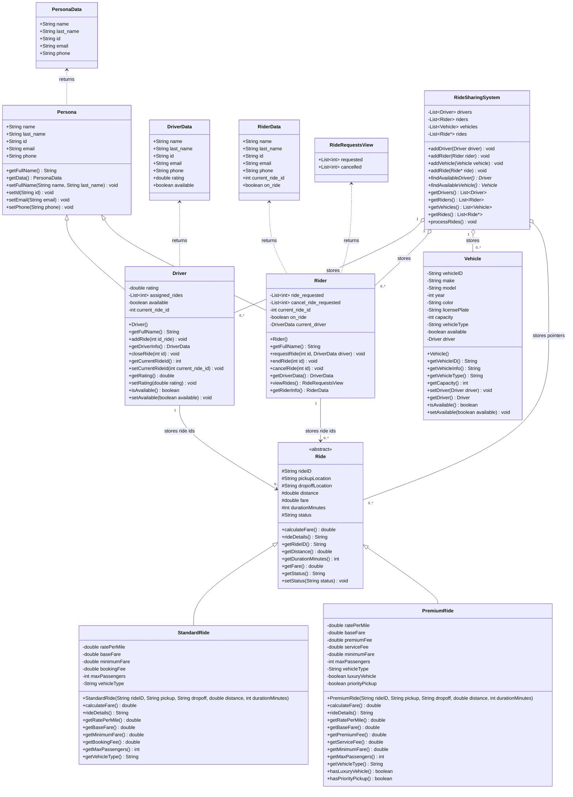

# Ride Sharing System

The Ride Sharing System must include the following components at a minimum. You should add additional functionality and feel free to be creative.

1. Ride Class:
   Create a base class Ride that holds core details such as rideID, pickupLocation, dropoffLocation, distance, durationMinutes, and fare.
   Define methods for calculating the fare() based on distance and duration, and a rideDetails() method to display ride information.
2. Specific Ride Subclasses:
   Implement at least two derived classes of Ride, such as StandardRide and PremiumRide.
   Each subclass should override the fare() method to calculate the fare based on ride type. Standard rides cost 1.50 USD per mile/minute, and premium rides cost 1.00 USD per mile/minute.
   Demonstrate polymorphism by calling the overridden fare() method on a list of different ride types.
3. Driver Class:
   Create a Driver class with attributes like driverID, name, rating, and assignedRides, a list of rides completed by the driver.
   Include methods such as addRide(Ride ride) to add rides to the driver’s list and getDriverInfo() to display driver details.
   Use encapsulation to keep assignedRides private and accessible only through defined methods.
4. Rider Class:
   Create a Rider class with attributes like riderID, name, and requestedRides, a list of rides requested by the rider.
   Include methods such as requestRide(Ride ride) to add a ride to the rider’s requested list, and viewRides() to display ride history.
5. System Functionality
   Demonstrate polymorphism by storing rides of different types in a list (array or collection) and invoking fare() and rideDe- tails() polymorphically.

## Current Class Diagram

This diagram reflects the classes currently implemented in `src/`.

Fare formulas:

- Standard fare = `1.5 * (distance + durationMinutes)`
- Premium fare = `1.0 * (distance + durationMinutes)`



## Simulation Cases

The current `main.cpp` demo runs a scripted ride-sharing scenario for assignment output screenshots.

- The system starts with 3 drivers: Hall Coode, Izabel Balding, and Elden McQuillen.
- The system starts with 5 riders: 3 standard riders and 2 premium riders.
- The system starts with 3 vehicles: 1 standard vehicle and 2 premium vehicles.
- The simulation creates 10 ride requests using both `StandardRide` and `PremiumRide` objects.
- Request 3 is rejected because the only standard vehicle is already assigned.
- Starting at request 5, completed rides release their driver and vehicle so later requests can be assigned again.
- Standard ride fare is calculated as `1.5 * (distance + durationMinutes)`.
- Premium ride fare is calculated as `1.0 * (distance + durationMinutes)`.
- Polymorphism is demonstrated by storing both `StandardRide` and `PremiumRide` objects as `Ride*` and calling `calculateFare()` and `rideDetails()` through the base class pointer.

## Results

```bash
❯ make
/opt/homebrew/bin/gst  lib/person/persona.st lib/person/driver.st lib/person/rider.st lib/vehicle.st lib/rides/rides.st lib/rides/standard_ride.st lib/rides/premium_ride.st lib/sharing_system.st lib/main.st
"Global garbage collection... done"
Ride Sharing System Simulation
Drivers: 3 | Riders: 5 (3 standard, 2 premium) | Vehicles: 3 (1 standard, 2 premium) | Ride requests: 10

Request 1 by Bertha Byrd for a Standard ride: R001
Assigned
Driver: Hall Coode
Vehicle: V001 - Chevrolet Impala (2020) White - STD-001
Standard Ride R001 from Campus to Downtown - Miles: 5.00 - Minutes: 12 - Status: assigned
Fare: $25.50

	Request 2 by Christel Chipchase for a Premium ride: R002
	Assigned
	Driver: Izabel Balding
	Vehicle: V002 - Aston Martin DBS (2023) Black - PRE-001
	Premium Ride R002 from Airport to Hotel - Miles: 10.00 - Minutes: 25 - Status: assigned
	Fare: $35.00

Request 3 by Blakeley Kalinsky for a Standard ride: R003
No available driver or Standard vehicle for R003

Request 4 by Gillan Auger for a Premium ride: R004
Assigned
Driver: Elden McQuillen
Vehicle: V003 - Infiniti QX56 (2022) Blue - PRE-002
Premium Ride R004 from Station to Museum - Miles: 8.00 - Minutes: 18 - Status: assigned
Fare: $26.00

	Completed R002; driver and Premium vehicle are available again.
	Request 5 by Christel Chipchase for a Premium ride: R005
	Assigned
	Driver: Izabel Balding
	Vehicle: V002 - Aston Martin DBS (2023) Black - PRE-001
	Premium Ride R005 from Hospital to Campus - Miles: 6.20 - Minutes: 15 - Status: assigned
	Fare: $21.20

Completed R004; driver and Premium vehicle are available again.
Request 6 by Gillan Auger for a Premium ride: R006
Assigned
Driver: Elden McQuillen
Vehicle: V003 - Infiniti QX56 (2022) Blue - PRE-002
Premium Ride R006 from Downtown to Airport - Miles: 12.00 - Minutes: 28 - Status: assigned
Fare: $40.00

	Completed R001; driver and Standard vehicle are available again.
	Request 7 by Reynolds Stubbin for a Standard ride: R007
	Assigned
	Driver: Hall Coode
	Vehicle: V001 - Chevrolet Impala (2020) White - STD-001
	Standard Ride R007 from Park to Theater - Miles: 4.70 - Minutes: 10 - Status: assigned
	Fare: $22.04

Completed R005; driver and Premium vehicle are available again.
Request 8 by Christel Chipchase for a Premium ride: R008
Assigned
Driver: Izabel Balding
Vehicle: V002 - Aston Martin DBS (2023) Black - PRE-001
Premium Ride R008 from Hotel to Restaurant - Miles: 2.80 - Minutes: 7 - Status: assigned
Fare: $9.80

	Completed R007; driver and Standard vehicle are available again.
	Request 9 by Bertha Byrd for a Standard ride: R009
	Assigned
	Driver: Hall Coode
	Vehicle: V001 - Chevrolet Impala (2020) White - STD-001
	Standard Ride R009 from Gym to Home - Miles: 7.10 - Minutes: 16 - Status: assigned
	Fare: $34.65

Completed R006; driver and Premium vehicle are available again.
Request 10 by Gillan Auger for a Premium ride: R010
Assigned
Driver: Elden McQuillen
Vehicle: V003 - Infiniti QX56 (2022) Blue - PRE-002
Premium Ride R010 from Office to Stadium - Miles: 9.40 - Minutes: 20 - Status: assigned
Fare: $29.40
```

## Author

Carlos Gutierrez

Email: cgutierrez44833@ucumberlands.edu

## License

This project is licensed under the MIT License. See `LICENSE` for details.

Copyright (c) 2026 Carlos Gutierrez.
